## PD

### self play:

baseline (rl7270)
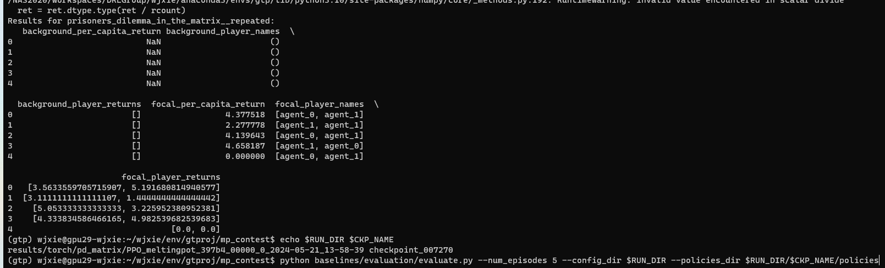

rl_3c764_150 (150steps) (MyEpsExp)
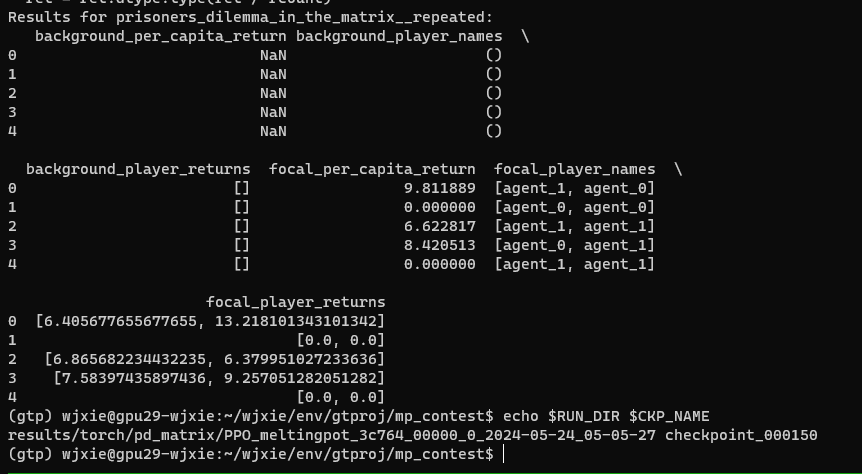

### test cases
rl7270:
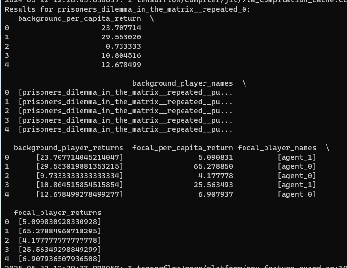

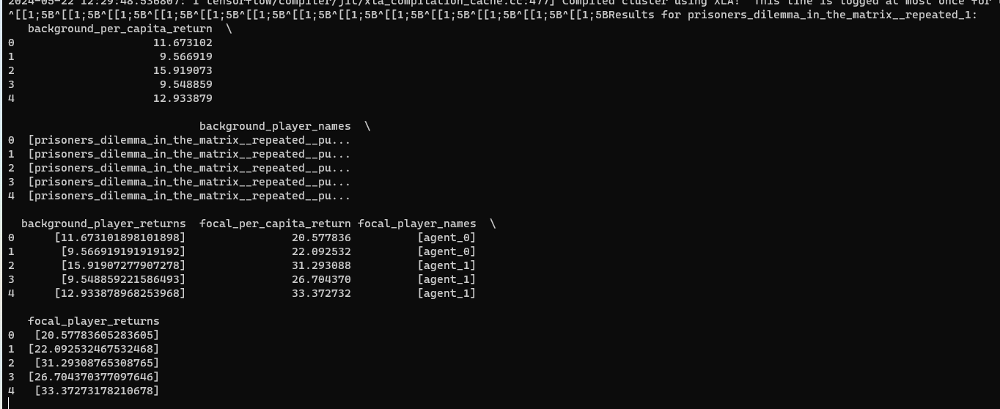

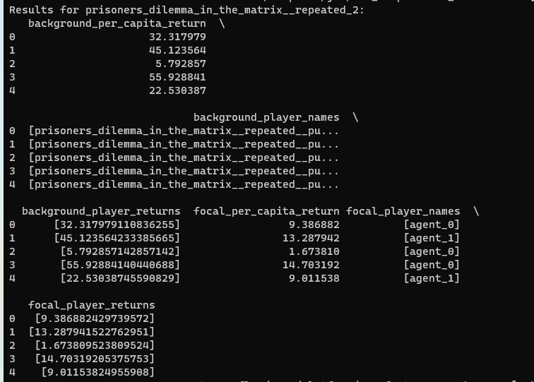

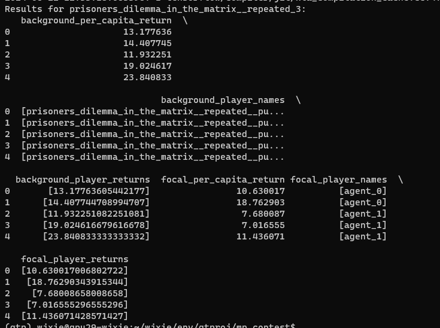

rl_3c764_150:
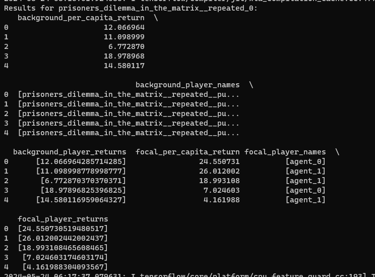

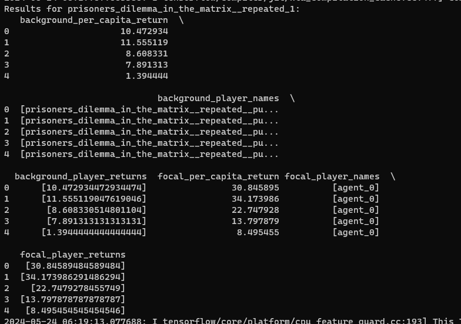

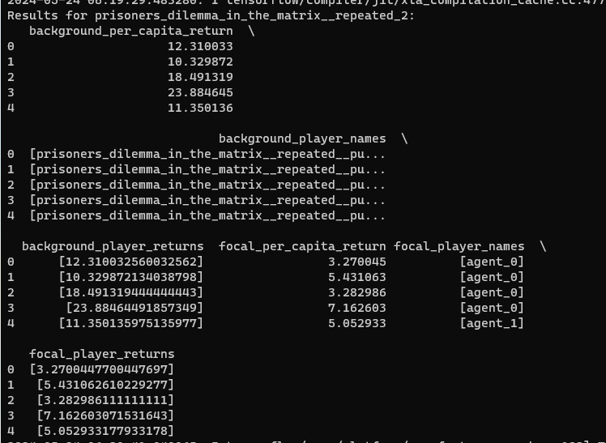

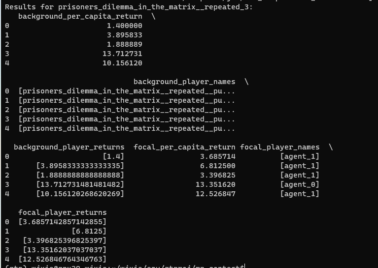

### jidi scenarios:

rl2500:
- n_return:  [4.841031746031746]
- n_return:  [4.675925925925926]

rl7270:
- n_return:  [17.877513227513226]
- n_return:  [25.3781746031746]
- n_return:  [21.571825396825396]

他给的rl_agent的结果: 
- 16.2323
- n_return:  [12.377314814814813]
- n_return:  [16.189700577200576]
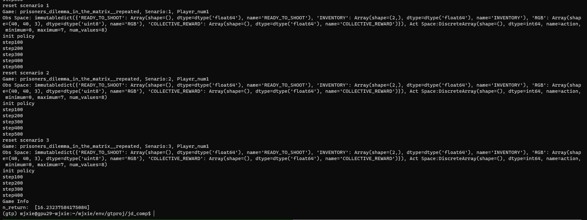

random:
- n_return:  [16.51219135802469]  
- "n_return": [18.624486855736855]
- "n_return": [15.811031746031746]

### jidi competition:
- rl7270-rl7270: 
    - n_return:  [1.722222222222222, 2.9722222222222223]
    - n_return:  [0.0, 0.0]
- rl7270-random: 
    - n_return:  [0.0, 0.0]

## Clean up

### self play:

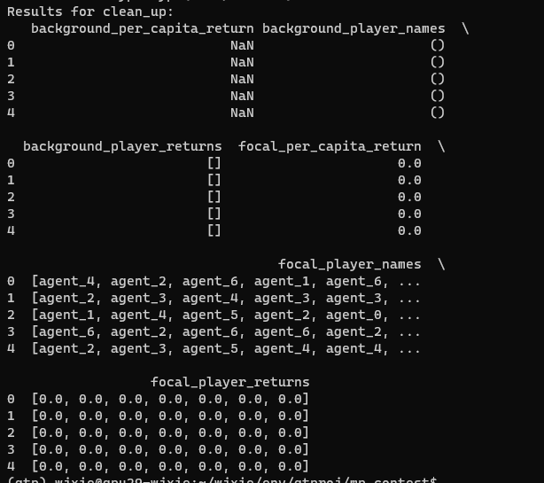

### testcases

RUN_DIR=results/torch/clean_up/PPO_meltingpot_5ecb9_00000_0_2024-05-21_14-28-20
CKP_NAME=checkpoint_000100

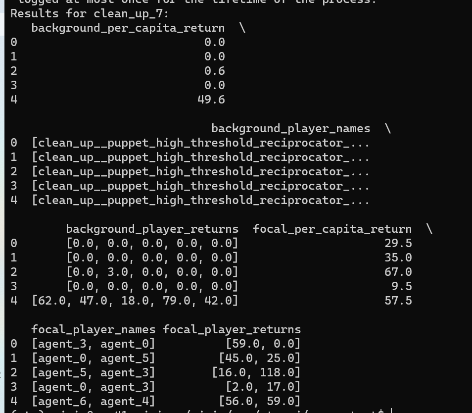